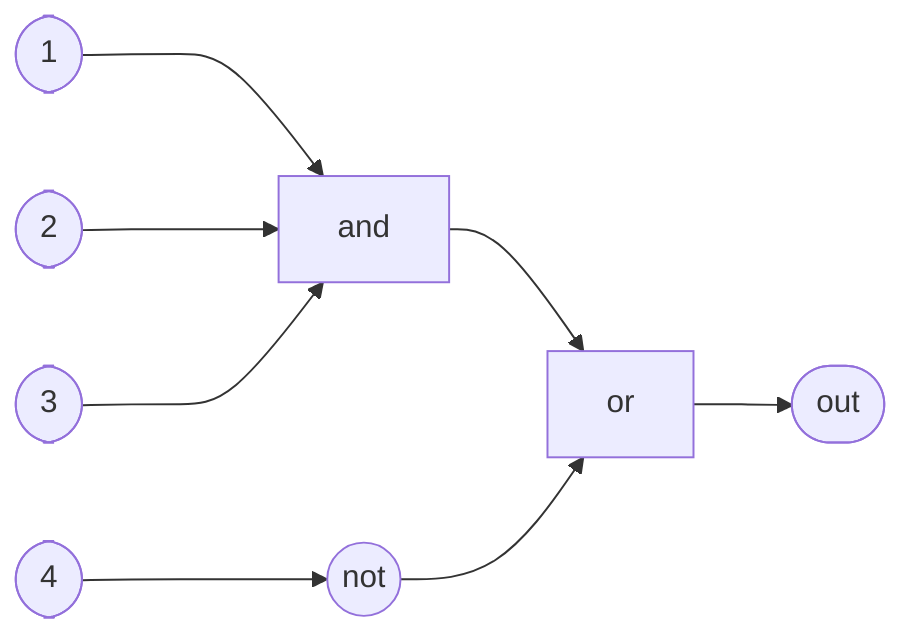
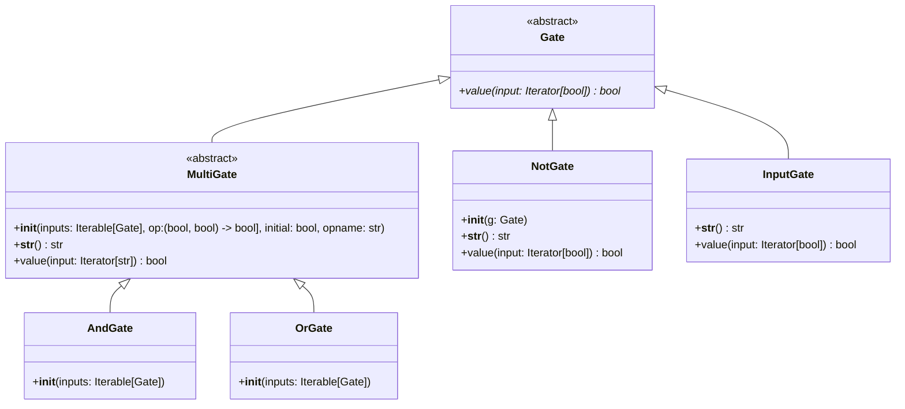

```mermaid
graph LR
    term1([1]) & term2([2]) & term3([3]) ---> and[and]
    term4([4]) ---> not((not))
    and & not --> or[or] --> out([out])
```

```mermaid
classDiagram
    Gate <|-- MultiGate
    MultiGate <|-- AndGate
    MultiGate <|-- OrGate
    Gate <|-- NotGate
    Gate <|-- InputGate
    class Gate {
        <<abstract>>
        +value(input: Iterator[bool])* bool
    }
    class MultiGate {
        <<abstract>>
        +__init__(inputs: Iterable[Gate], op: (bool, bool) -> bool], initial: bool, opname: str)
        +__str__() str
        +value(input: Iterator[str]) bool
    }
    class InputGate {
        +__str__() str
        +value(input: Iterator[bool]) bool
    }
    class AndGate {
        +__init__(inputs: Iterable[Gate])
    }
    class OrGate {
        +__init__(inputs: Iterable[Gate])
    }
    class NotGate {
        +__init__(g: Gate)
        +__str__() str
        +value(input: Iterator[bool]) bool
    }
```