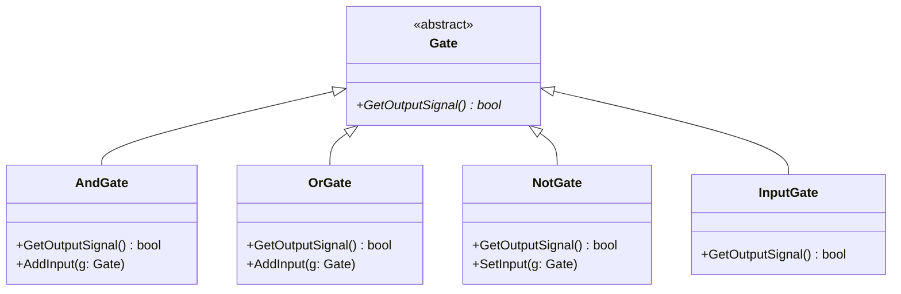

```mermaid
graph LR
    term1([1]) & term2([2]) & term3([3]) ---> and[and]
    term4([4]) ---> not((not))
    and & not --> or[or] --> out([out])
```

```mermaid
classDiagram
    Gate <|-- AndGate
    Gate <|-- OrGate
    Gate <|-- NotGate
    Gate <|-- InputGate
    class Gate {
        <<abstract>>
        +GetOutputSignal()* bool
    }
    class InputGate {
        +GetOutputSignal() bool
    }
    class AndGate {
        +GetOutputSignal() bool
        +AddInput(g: Gate)
    }
    class OrGate {
        +GetOutputSignal() bool
        +AddInput(g: Gate)
    }
    class NotGate {
        +GetOutputSignal() bool
        +SetInput(g: Gate)
    }
```